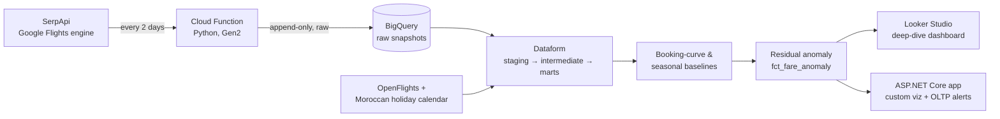

# Airfare Drift

**A governed, tested, dimensional data warehouse that models the full pricing microstructure of one thin transatlantic air market — Atlanta ⇄ Casablanca (ATL–CMN) — and detects when it's pricing abnormally.**

The centerpiece isn't "fares go up near departure" (that impresses nobody). It's a **residual anomaly layer**: the deviation of an observed fare from a *fitted expectation* built out of the route's own booking curve and seasonality — so the signal is *"this fare is 2.6σ above what this lead time and season should cost,"* not a comparison against a flat historical average.

> **What it is:** an analytics / data-engineering showcase.
> **What it isn't:** a "should I book now?" tool. Google Flights owns the live quote. This owns the question *"is ATL–CMN pricing normally given the lead time, the season, and the route's own history — and if not, why?"* Every figure is stamped with an explicit *"as of <observation time>."*

---

## Why one route, in depth

Ten near-identical route pipelines read as one pipeline copy-pasted. **One route modeled richly** — booking curve, seasonality, routing/carrier competition, price dispersion, holiday-event correlation — reads as genuine analytical engineering.

ATL–CMN was chosen because it's a genuinely interesting market to model, not a toy:

- **No nonstop exists** (Royal Air Maroc doesn't fly it), so it's a *connecting market* — the same trip routes via Montreal, Paris, JFK, etc., across multiple carriers, with wide price dispersion (a single snapshot spanned $1,132 → $1,769).
- The competitive structure is **routing / hub / carrier competition**, which is far richer to model than a single-carrier price series.
- Every API call returns a **whole market cross-section** (many itineraries × legs), so a booking-curve model — normally starved for data — gets fed densely from a fixed-date panel.

The control lives *inside* the route: observed fare vs. the model's own fitted surface. The anomaly is the residual.

## Pipeline



A single round-trip call captures a full offer cross-section — price, routing, layovers, operating carrier, aircraft, departure times, codeshares, and Google's own price-history — stored **verbatim and uncleaned** on purpose. Parsing, unnesting, dedup, and derivation all happen downstream in Dataform, which is what makes that layer worth writing.

## Engineering highlights

- **Incremental correctness as the core challenge.** Incremental models scan only new partitions — both a cost guardrail (stay in the BigQuery free tier) and the technical point of the project. The residual z-scores and the SCD2 dimension are treated as the incremental-correctness problems they are.
- **Messy-by-design raw layer.** Duplicate snapshots, late arrivals, deeply-nested offer arrays, and API quirks are preserved intact; cleaning is a downstream transform, not an ingestion side-effect.
- **A modeled seasonal wrinkle worth talking about:** Ramadan/Eid shift ~11 days earlier each year on the lunar calendar — a moving seasonal component the model is built to accommodate, then correlated against a Moroccan holiday/events calendar.
- **Governed warehouse:** Dataform assertions (freshness, referential integrity, reasonableness bounds, unnest integrity), SCD Type 2 itinerary dimension, and proper dev/prod environment separation.
- **Resilient continuous ingestion:** per-call error isolation, scheduler retries with bounded backoff, and a freshness assertion as a detection backstop — because the anomaly layer is only as good as its uninterrupted history.
- **Two consumption paths over one warehouse, by design:** a zero-code Looker Studio deep-dive (the "I know BI tools" signal) and a bespoke ASP.NET Core analytical front-end backed by a real serving layer (cached query / serving table — never a per-page mart scan) plus a Postgres OLTP store for alert subscriptions and human-in-the-loop anomaly annotations.

## Tech stack

| Layer | Tools |
|---|---|
| Warehouse / transform | BigQuery + Dataform (SQLX, incremental models, assertions, environments) |
| Ingestion | Python Cloud Function on Cloud Scheduler → date-partitioned raw BigQuery tables |
| Sources | SerpApi Google Flights engine (live fares), OpenFlights reference data, a Moroccan holiday/events calendar |
| Consumption | Looker Studio (native BQ connector) · ASP.NET Core MVC (`Google.Cloud.BigQuery.V2`, a JS charting lib, EF Core / Npgsql over Postgres) |

Runs inside free tiers with a $0–5/month cost target.

## Status

This is an actively-built project; the ingestion clock is running so history accumulates while the warehouse is built on top of it.

- ✅ **Ingestion live** — every-2-days Cloud Function → BigQuery path deployed and verified end-to-end, on a single-route fixed-date panel that traces booking curves across lead times and seasons.
- 🔜 **Dataform warehouse** — staging → incremental booking-curve/seasonal baselines → the residual-anomaly marts → assertions.
- 🔜 **Consumption** — Looker Studio deep-dive first, then the ASP.NET Core app, once the marts hold enough history to render real signal rather than empty axes.

Signals mature honestly: the booking curve fills in over weeks, seasonality over a year. Until a layer's data matures, any surface shows context and hands off — it never over-promises a call the data can't yet support.

## Repository layout

```
ingestion/   Python Cloud Function — SerpApi → BigQuery raw snapshots
docs/         Design decisions, raw-data shape, warehouse & consumer plans
scripts/      Standalone smoke tests (e.g. SerpApi connectivity)
CLAUDE.md     Internal working brief
```

## Running the ingestion locally

```bash
python -m venv .venv && ./.venv/bin/pip install requests google-cloud-bigquery
export SERPAPI_KEY=...           # from a SerpApi free-tier account
./.venv/bin/python ingestion/main.py --dry-run   # fetches, prints, no BigQuery write
```

The dry run exercises the full panel against the live API without writing to BigQuery; production deployment runs on Cloud Scheduler.
