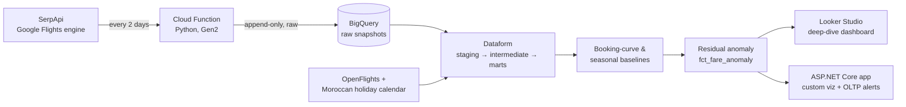

# ✈️ airfare drift

A governed, tested, dimensional data warehouse for one thin transatlantic air market — Atlanta ⇄ Casablanca (ATL–CMN) — that flags when the route prices abnormally.

The signal is not "fares go up near departure." It's a **residual anomaly layer**: the deviation of an observed fare from a *fitted expectation* built from the route's own booking curve and seasonality, so a flag reads *"this fare is 2.6σ above what this lead time and season should cost"* rather than a comparison against a flat historical average.

> **What it is:** an analytics / data-engineering project answering *"is ATL–CMN pricing normally given the lead time, the season, and the route's own history, and if not, why?"*
>
> **What it isn't:** a "should I book now?" tool. Google Flights owns the live quote. Every figure carries an explicit *"as of <observation time>."*

---

## about the route

ATL–CMN is a **thin, connecting-only market** — no nonstop exists (Royal Air Maroc doesn't fly it), so the same trip routes via Montreal, Paris, JFK, etc., across multiple carriers, with wide price dispersion (a single snapshot spanned $1,132 → $1,769). The competitive structure is **routing / hub / carrier competition**, far richer than a single-carrier price series — and every API call returns a whole market cross-section (many itineraries × legs), feeding a booking-curve model that's normally starved for data.

The project covers this one route in depth rather than many routes shallowly — booking curve, seasonality, routing/carrier competition, price dispersion, holiday-event correlation. The control lives *inside* the route: observed fare vs. the model's own fitted surface, and the anomaly is the residual.

## pipeline



A single round-trip call captures a full offer cross-section — price, routing, layovers, operating carrier, aircraft, departure times, codeshares, and Google's own price-history — stored verbatim and uncleaned on purpose. Parsing, unnesting, dedup, and derivation all happen downstream in Dataform.

## engineering notes

- **Incremental correctness.** Models scan only new partitions — both a cost guardrail (BigQuery free tier) and the main technical problem. The residual z-scores and the SCD2 dimension are handled as incremental-correctness problems.
- **Raw layer kept messy by design.** Duplicate snapshots, late arrivals, deeply-nested offer arrays, and API quirks are preserved intact; cleaning is a downstream transform, not an ingestion side-effect.
- **Seasonal wrinkle.** Ramadan/Eid shift ~11 days earlier each year on the lunar calendar — a moving seasonal component the model accommodates, then correlates against a Moroccan holiday/events calendar.
- **Governance.** Dataform assertions (freshness, referential integrity, reasonableness bounds, unnest integrity), an SCD Type 2 itinerary dimension, dev/prod environment separation.
- **Ingestion resilience.** Per-call error isolation, scheduler retries with bounded backoff, and a freshness assertion as a detection backstop, so history accumulates without gaps.
- **Two consumption paths, one warehouse.** A Looker Studio dashboard and an ASP.NET Core front-end over a serving layer (cached query / serving table, not a per-page mart scan), plus a Postgres OLTP store for alert subscriptions and anomaly annotations.

## tech stack

| Layer | Tools |
|---|---|
| Warehouse / transform | BigQuery + Dataform (SQLX, incremental models, assertions, environments) |
| Ingestion | Python Cloud Function on Cloud Scheduler → date-partitioned raw BigQuery tables |
| Sources | SerpApi Google Flights engine (live fares), OpenFlights reference data, a Moroccan holiday/events calendar |
| Consumption | Looker Studio (native BQ connector) · ASP.NET Core MVC (`Google.Cloud.BigQuery.V2`, a JS charting lib, EF Core / Npgsql over Postgres) |

Runs inside free tiers with a $0–5/month cost target.

## status

This is an actively-built project; the ingestion clock is running so history accumulates while the warehouse is built on top of it.

- ✅ **Ingestion live** — every-2-days Cloud Function → BigQuery path deployed and verified end-to-end, on a single-route fixed-date panel that traces booking curves across lead times and seasons.
- 🔜 **Dataform warehouse** — staging → incremental booking-curve/seasonal baselines → the residual-anomaly marts → assertions.
- 🔜 **Consumption** — Looker Studio deep-dive first, then the ASP.NET Core app, once the marts hold enough history to render real signal rather than empty axes.

The signals mature over time: the booking curve fills in over weeks, seasonality over a year. Until a layer's data matures, any surface shows context and hands off rather than reporting a result the data can't yet support.

## repository layout

```
ingestion/   Python Cloud Function — SerpApi → BigQuery raw snapshots
docs/         Design decisions, raw-data shape, warehouse & consumer plans
scripts/      Standalone smoke tests (e.g. SerpApi connectivity)
CLAUDE.md     Internal working brief
```

## running the ingestion locally

```bash
python -m venv .venv && ./.venv/bin/pip install requests google-cloud-bigquery
export SERPAPI_KEY=...           # from a SerpApi free-tier account
./.venv/bin/python ingestion/main.py --dry-run   # fetches, prints, no BigQuery write
```

The dry run exercises the full panel against the live API without writing to BigQuery; production deployment runs on Cloud Scheduler.
